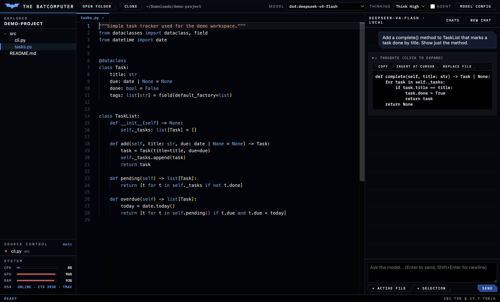
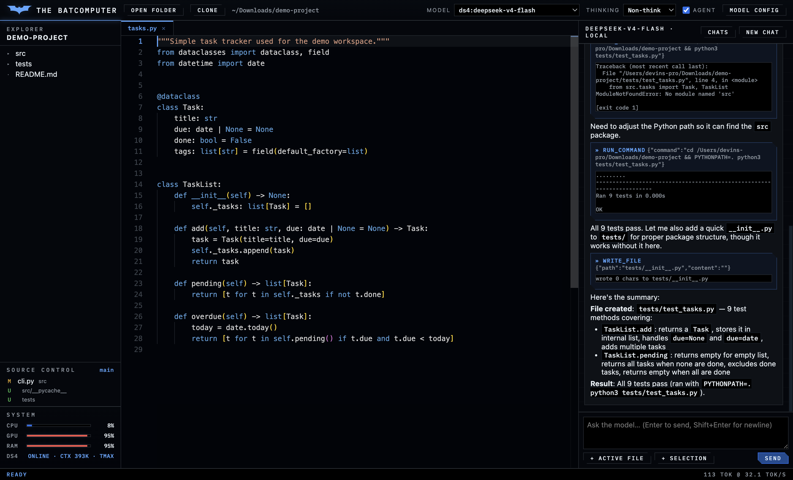
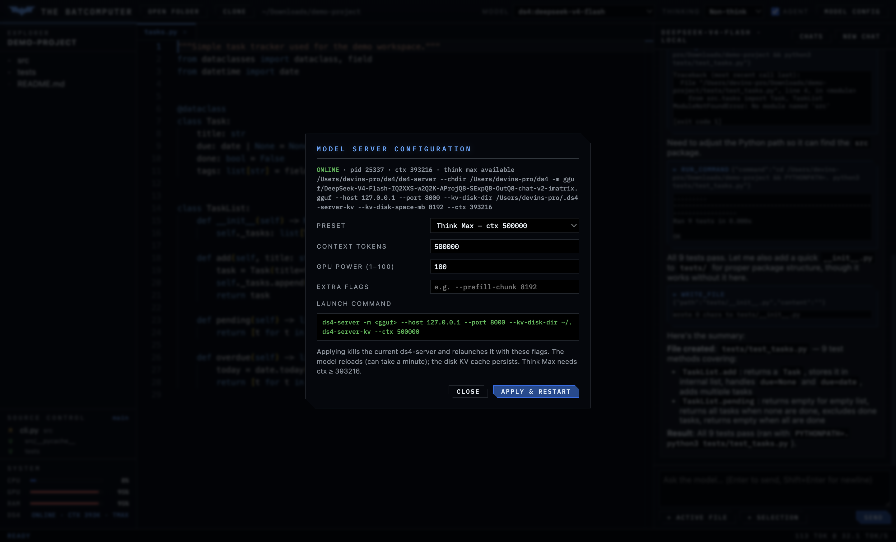

<table>
  <tr>
    <td></td>
    <td><h1>Local-LLM-IDE</h1></td>
    <td>
      <p align="right">
        
        
        
        
      </p>
    </td>
  </tr>
</table>

<h2>Description</h2>
<br/>
In this project, we build a Batcomputer-styled desktop IDE for locally hosted LLMs: a black wireframe-blue HUD with angular panels, a live SYSTEM readout (CPU, GPU, RAM, model status), and an original bat emblem. The app combines the Monaco editor (the editor component that powers VS Code), a file explorer, and a streaming chat panel with an agent mode that can read files, write files, and run shell commands inside the open workspace. Everything runs against inference servers on localhost, so the IDE works fully offline with no API keys and no cloud dependency. Any model behind a local OpenAI-compatible endpoint or an Ollama daemon can drive it; the reference setup here is DeepSeek V4 Flash served by DwarfStar's <code>ds4-server</code>.
<br />
<br/> Project Architecture: <br/>

<br/> The Electron shell embeds an Express backend that serves the UI and exposes a small local API. Chat requests are proxied to whichever local model is selected in the dropdown: a DwarfStar <code>ds4-server</code> instance serving a GGUF over an OpenAI-compatible API using Metal on Apple Silicon, or any model running under a local Ollama daemon. If no <code>ds4-server</code> is listening, the IDE starts one automatically as a detached process, so a single <code>npm start</code> brings up the entire stack. <br/> <br/> The Explorer sidebar shows the workspace the model is working in, and the chat panel header always reflects the active model. Because the IDE and a terminal agent can memory-map the same GGUF file, running both side by side does not load the weights into RAM twice. <br/>

<br/>

<h2> Components involved: </h2>

| **Component**          | **Purpose**                                                                 |
|------------------------|-----------------------------------------------------------------------------|
| **Electron**           | Desktop shell that hosts the UI and the embedded backend on a private localhost port. |
| **Monaco Editor**      | Code editing with tabs, syntax highlighting, and Cmd+S save.                |
| **Express backend**    | Serves the UI, exposes the workspace file API, and proxies streaming chat.  |
| **ds4-server (DwarfStar)** | Runs DeepSeek V4 Flash from a local GGUF and exposes OpenAI-compatible endpoints on `127.0.0.1:8000`. |
| **Agent tool loop**    | Lets the model call `read_file`, `write_file`, `list_directory`, and `run_command`, scoped to the open workspace. |
| **Ollama** (optional)  | Any locally pulled Ollama model shows up in the model dropdown alongside DeepSeek. |
| **Chat sessions**      | Conversations persist to `~/.local-llm-ide/chats/`; the Chats panel reopens or deletes any previous session. |
| **Web tools**          | `web_search` and `fetch_url` are always available to the model (keyless, via DuckDuckGo) — the weights are offline, but live facts aren't. |
| **Git integration**    | Clone any repo from the top bar; a Source Control panel shows the branch and changed files, with side-by-side Monaco diffs against HEAD. |

### **Notes for Usage**
1. **Required**: Node.js 20+ and one local inference server — DwarfStar `ds4-server` with a DeepSeek V4 Flash GGUF (default), or an Ollama daemon with at least one pulled model.
2. **Optional**: Ollama for additional models; a `--ctx` of 393216 or higher on `ds4-server` if you want Think Max mode.
3. **Security**: the backend binds to `127.0.0.1` only, and file access is restricted to the workspace folder you open. Agent mode executes real shell commands without a confirmation step, so only enable it in folders you trust it to modify.

### **Prerequisites**
- macOS on Apple Silicon (tested on an M5 Max with 128 GB unified memory)
- [Node.js](https://nodejs.org/) 20 or newer
- A local model server: [DwarfStar ds4](https://github.com/antirez/ds4) with a DeepSeek V4 Flash GGUF, and/or [Ollama](https://ollama.com/)

## Step 1: Install and launch

```sh
git clone https://github.com/DevinLiggins14/Local-LLM-IDE.git
cd Local-LLM-IDE
npm install
npm start        # desktop app
# or: npm run web   then open http://127.0.0.1:4517
```

<br/> On launch the backend looks for a ds4-server on <code>127.0.0.1:8000</code>. If one is already running it is reused; if not, the IDE starts one automatically with a disk KV cache and a Think Max capable context, and the model list updates once loading finishes (log at <code>~/.ds4-server.log</code>). <br/>
<br/> If Electron fails to start after install with an "Electron failed to install correctly" error, run <code>node node_modules/electron/install.js</code> once and start again. <br/>

## Step 2: Open a workspace and chat



<br/> Use <b>Open Folder</b> to pick a workspace, or <b>Clone</b> to clone a git URL into <code>~/Downloads</code> and open it directly. When the workspace is a git repository, a <b>Source Control</b> section in the sidebar shows the current branch and every changed file — click one for a side-by-side diff of the working tree against HEAD. Files open in Monaco tabs, and Cmd+S saves to disk. The chat panel streams straight from the local model: reasoning appears live in a collapsible thoughts box, and the status bar reports tokens per second for every reply. <br/>
<br/> The <b>+ Active file</b> and <b>+ Selection</b> buttons attach editor content to your next message, and every code block in a reply has <b>Copy</b>, <b>Insert at cursor</b>, and <b>Replace file</b> actions. The Thinking dropdown switches between the model's three modes: <br/>

| **Mode**     | **Behavior**                                                                  |
|--------------|-------------------------------------------------------------------------------|
| **Non-think** | Direct answers, fastest responses. Good for quick completions and commands.  |
| **Think High** | Standard reasoning mode (server default). Good for refactors and debugging. |
| **Think Max** | Deepest reasoning. Requires `ds4-server --ctx 393216` or larger; smaller contexts fall back to Think High automatically. |

The thinking dropdown applies to any model that supports reasoning modes — Ollama models with thinking support use the same toggle.

Every conversation is stored on disk as soon as the model replies. The <b>Chats</b> button in the panel header lists stored sessions with timestamps; click one to reopen it with full context, or delete it with the ✕ on the row. <b>New chat</b> starts a fresh session without touching the stored ones.

## Step 3: Agent mode



<br/> Enabling the <b>Agent</b> checkbox gives the model four tools scoped to the workspace: <code>read_file</code>, <code>write_file</code>, <code>list_directory</code>, and <code>run_command</code>. Tool calls and their results render as cards in the conversation while the model works, and the file tree and open editors refresh automatically when the agent changes files. <br/>
<br/> In the run above, DeepSeek V4 Flash was asked to write unit tests for the open file: it created <code>tests/test_tasks.py</code>, executed it with <code>python3</code>, and reported every test passing — entirely offline. <br/>

## Step 4: Choose how the model runs



<br/> The <b>Model Config</b> panel controls the launch configuration of the DeepSeek inference server (ds4-server) itself — the same knobs as running <code>ds4-agent</code> by hand in a terminal. Pick a preset (for example Think Max with a 500,000-token context, the equivalent of <code>./ds4-agent --think-max --ctx 500000</code>), or set a custom context size, GPU power duty cycle, and any extra <code>ds4-server</code> flags. The panel shows the exact launch command and the live status of the current server: pid, context size, and whether Think Max is available. <br/>
<br/> <b>Apply &amp; Restart</b> kills the running ds4-server and relaunches it detached with the chosen flags; the SYSTEM readout in the sidebar tracks it through <code>LOADING MODEL…</code> back to <code>ONLINE</code>, along with live CPU, GPU, and RAM usage (CPU from kernel tick counters, GPU from the IOAccelerator utilization counters, RAM from <code>vm_stat</code> — the same sources Activity Monitor reads). <br/>

## Step 5: Configuration

<br/> Sampling is pinned to DeepSeek's recommended <code>temperature=1.0, top_p=1.0</code>; in thinking mode ds4-server applies its fixed sampling defaults regardless, matching DeepSeek's API behavior. Defaults can be overridden with environment variables: <br/>
<br/>

| **Variable**       | **Default**                          | **Purpose**                                   |
|--------------------|--------------------------------------|-----------------------------------------------|
| `DS4_URL`          | `http://127.0.0.1:8000`              | ds4-server endpoint.                          |
| `DS4_BIN`          | `~/ds4/ds4-server`                   | Binary used for auto-start.                   |
| `DS4_DIR`          | `~/ds4`                              | DwarfStar project directory (`--chdir`).      |
| `DS4_GGUF`         | DeepSeek V4 Flash GGUF               | Model file passed to the auto-started server. |
| `DS4_CTX`          | `393216`                             | Context size for the auto-started server.     |
| `DS4_AUTOSTART`    | `1`                                  | Set to `0` to never auto-start ds4-server.    |
| `OLLAMA_HOST_URL`  | `http://127.0.0.1:11434`             | Ollama daemon endpoint.                       |
| `PORT`             | `4517`                               | Backend port in browser mode (`npm run web`). |
